# LangGraph Smart Query Agent — LangGraph RAG + Weather AI Assistant

A simple, clean, and production-style demo that combines **LangGraph** (agentic routing), **RAG over PDFs (Qdrant vector DB)**, **real-time weather (OpenWeatherMap)**, and **Groq LLM** — wrapped in a friendly **Streamlit chat UI**.

👉 [**Live Demo**](https://langgraphragchatbot-connect.streamlit.app)


## ✨ What it does

Two tools, one agentic flow (LangGraph):

### 📡 Weather: Fetches real-time weather via OpenWeatherMap.

### 📚 RAG: Answers questions from your uploaded PDF using Qdrant + embeddings.

Router node decides whether a user query is about weather or the document.

Embeddings: sentence-transformers/all-MiniLM-L6-v2 (384-dim).

**LLM:** Groq llama-3.3-70b-versatile (configurable).

**UI**: Streamlit chat with inline PDF upload, progress messages, and guardrails (chat is temporarily disabled while indexing).

**Tests**: Pytest covering routing, synthesis, and API handling.

## 🧱 Tech Stack

**Core:** Python, Streamlit

**Agentic:** LangGraph + LangChain

**LLM:** Groq (Chat Completions)

**RAG:** Qdrant Cloud (vector DB), LangChain Qdrant integration

**Embeddings:** HuggingFace MiniLM (via langchain-community)

**Weather:** OpenWeatherMap REST API

**PDF:** pypdf + langchain-text-splitters

**Tests:** Pytest

## 🚀 Getting Started -Run Locally

1. Clone & enter the project

```bash
git clone https://github.com/aakash-kishan/Langgraph_RAG_Chatbot.git

cd Langgraph_RAG_Chatbot

python -m venv venv

# Windows:
venv\Scripts\activate

# macOS/Linux:
source venv/bin/activate

```
2. Install dependencies

```bash
pip install -r requirements.txt

```
3. Create .env from .env.example and fill your keys

4. Run
```bash

streamlit run app.py

```
## 🔐 Environment Variables

Copy .env.example → .env (local), and paste the same keys (TOML format) in Streamlit Cloud Secrets:

```toml
GROQ_API_KEY = "<your_groq_key>"
OWM_API_KEY = "<your_openweather_key>"

# Optional but recommended for tracing (if you use LangSmith)
LANGCHAIN_TRACING_V2 = true
LANGCHAIN_PROJECT = "langgraph-rag-weather"
LANGSMITH_API_KEY = "<your_langsmith_key>"

# Qdrant Cloud (recommended for deployment)
QDRANT_URL = "https://<your-cluster-id>.aws.cloud.qdrant.io"
QDRANT_API_KEY = "<your_qdrant_api_key>"
COLLECTION = "pdf-knowledge"

```
## ☁️ Deploy on Streamlit Community Cloud

1. Push your repo to GitHub (public).

2. Go to https://share.streamlit.io/

3. New App → pick the repo, branch main, app file app.py.

4. Open Settings → Secrets, paste your keys in TOML:

```toml
GROQ_API_KEY = "..."
OWM_API_KEY = "..."
LANGCHAIN_TRACING_V2 = true
LANGCHAIN_PROJECT = "langgraph-rag-weather"
LANGSMITH_API_KEY = "..."
QDRANT_URL = "https://<cluster>.aws.cloud.qdrant.io"
QDRANT_API_KEY = "..."
COLLECTION = "pdf-knowledge"

```
5. Qdrant Cloud Security → CORS: set Allowed Origins/Headers/Methods to * (or allow your Streamlit app domain).

6. Deploy-done!

## 🧪 Tests

Run all unit tests:

```bash

pytest -q

```

What’s covered:

  - Router: route_llm() correctly classifies weather vs RAG queries (with fallback heuristics).

  - Synthesis: polishing step returns clean text.

  - Weather: API path & error handling (uses fake or missing key to ensure non-crash behavior).

## 🧭 How the Agent Flow Works (LangGraph)

- The router uses a strict JSON prompt. If parsing fails, simple keyword heuristics fall back (e.g., “weather”, “temperature”, “rain”…).

- RAG: your PDF is loaded, chunked, embedded, and stored in Qdrant. A retriever is created and passed into the graph at runtime.

- Synthesis polishes the final answer (short, clear, actionable).


## 🖼️ Screenshots 

1. Home UI (no PDF)
     <p align="center">
    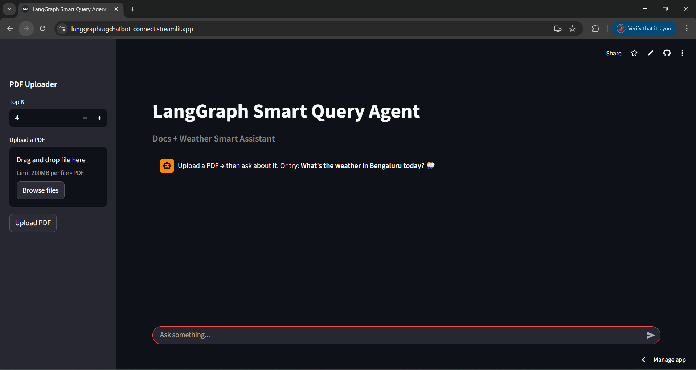
    </p>


2. Weather answer
    <p align="center">
    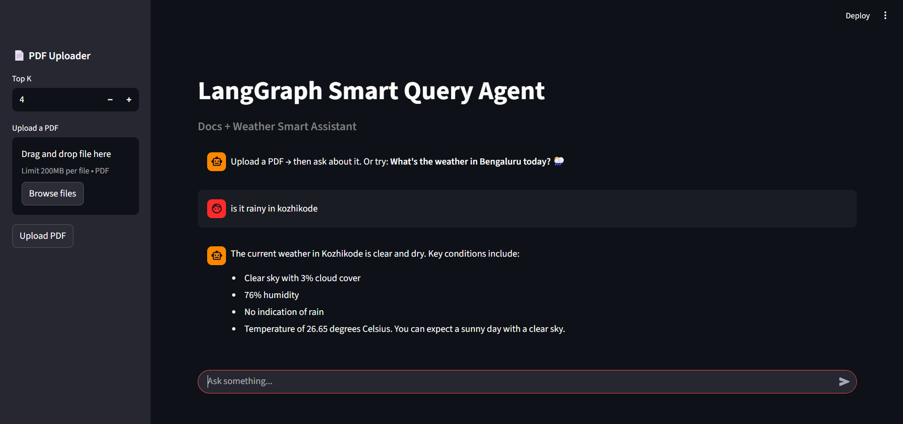
    </p>

3. Langsmith tracing of the above weather query
   <p align="center">
  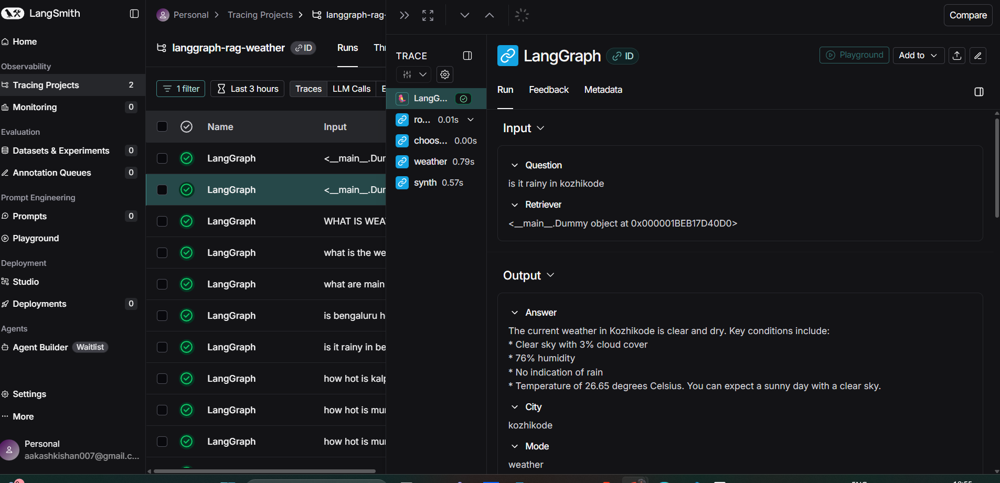
  </p>
  <p align="center">
    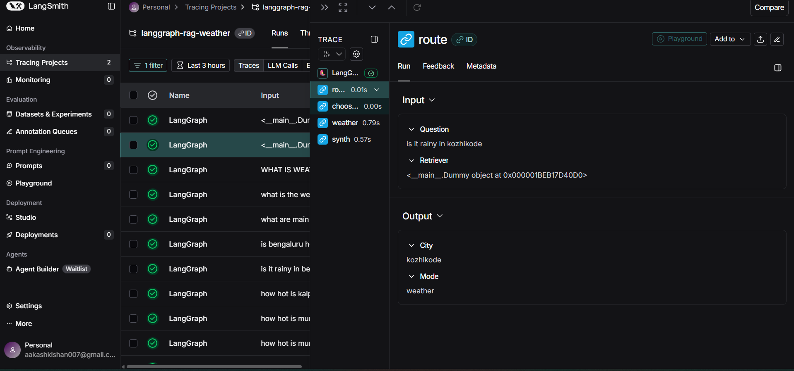
  </p>
  <p align="center">
     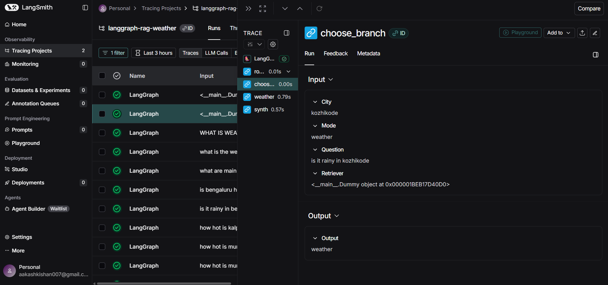
  </p>
  <p align="center">
     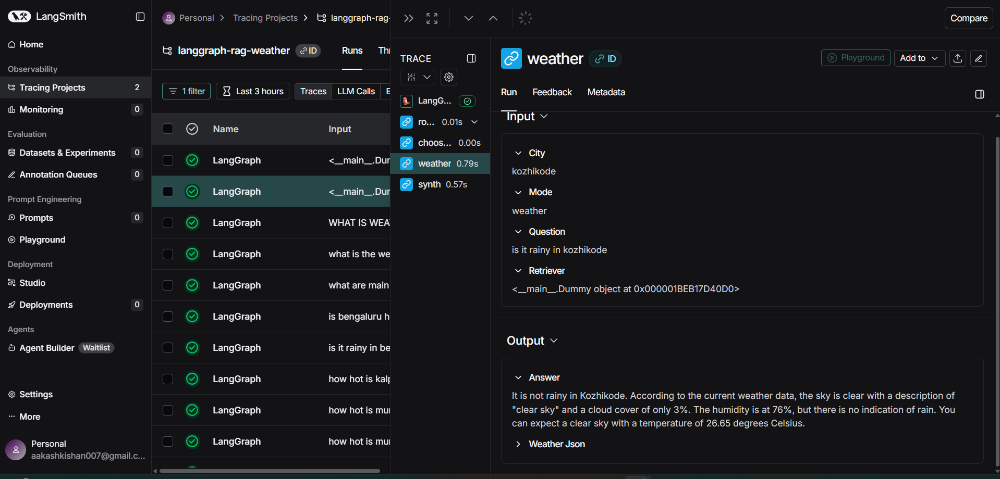
  </p>
  <p align="center">
     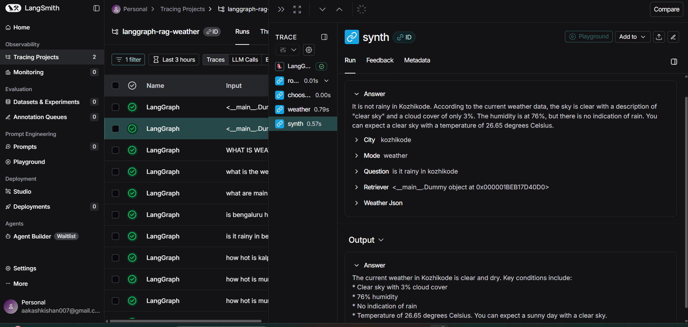
  </p>

4. Document Loading
  <p align="center">
     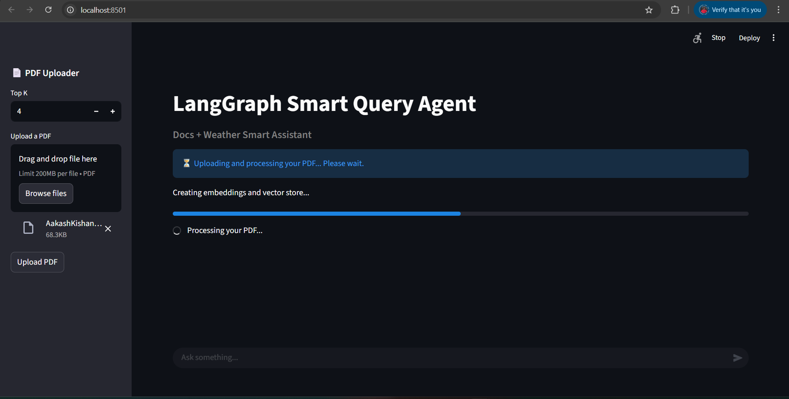
  </p>
5. PDF Uploaded
   <p align="center">
     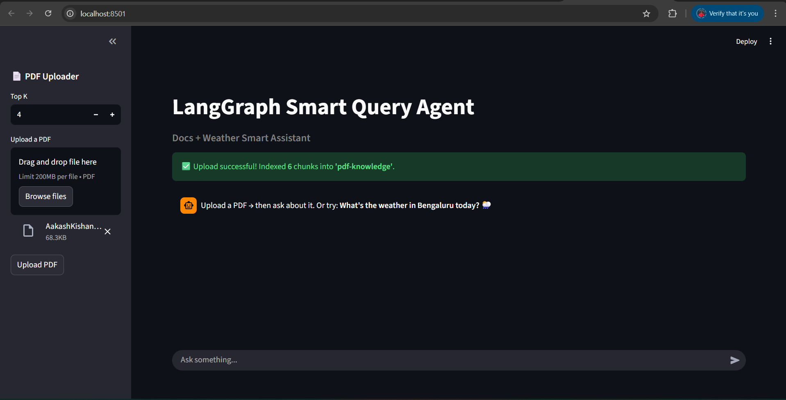
  </p>
6. User query and answer
   <p align="center">
     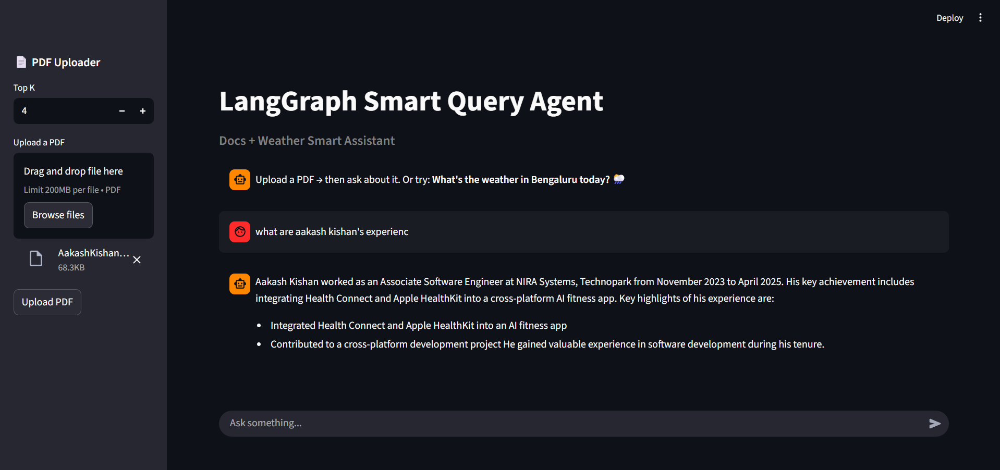
  </p>

7. Langsmith tracing of the above weather query of above rag query
   <p align="center">
     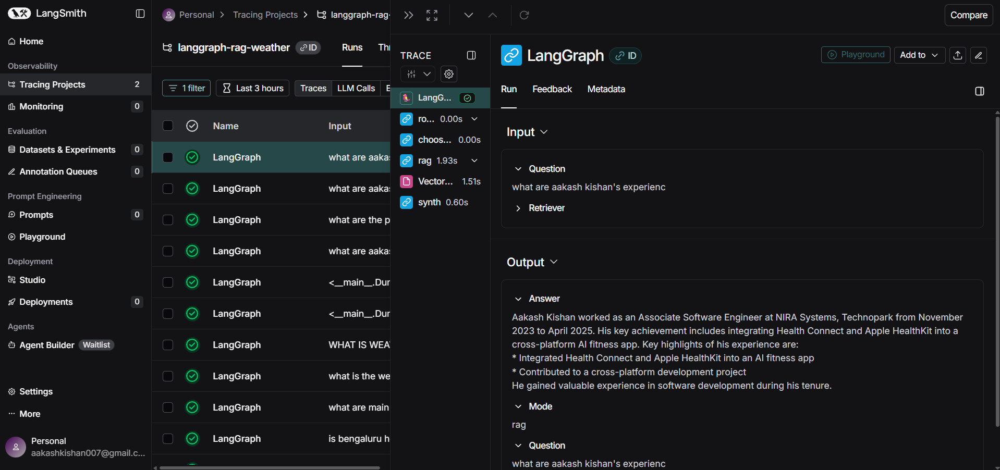
   </p>

   <p align="center">
     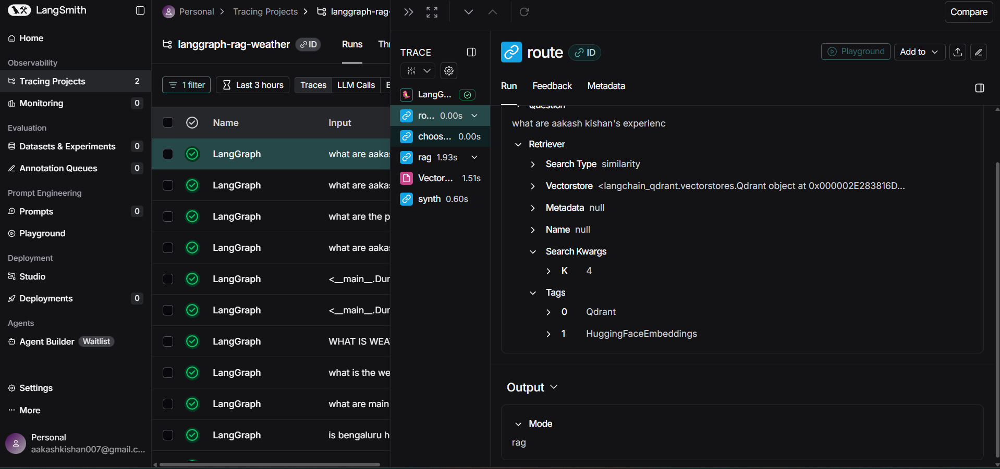
   </p>

   <p align="center">
     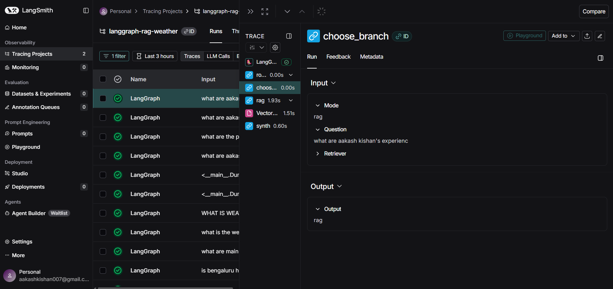
   </p>

   <p align="center">
     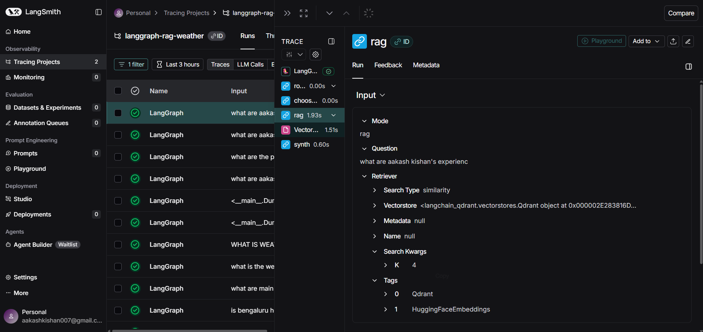
   </p>

<br>
  
    I have uploaded the same file 4 times.

   <p align="center">
     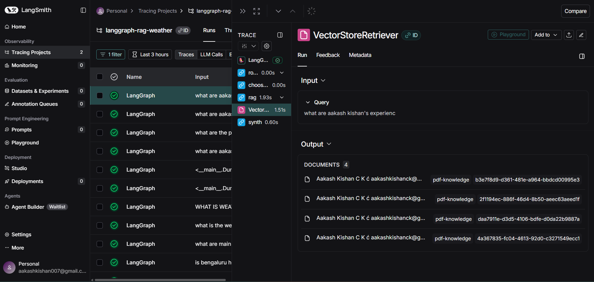
   </p>


   

   <p align="center">
     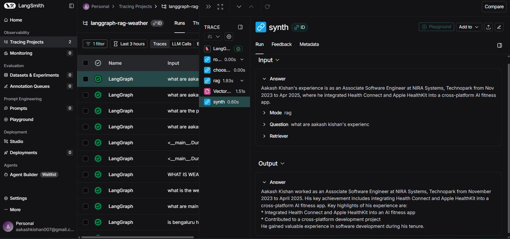
   </p>


## ⚙️ Configuration & Defaults

  
- Groq model: llama-3.3-70b-versatile (change in llm.py via get_chat_model()).
 
- Embeddings: all-MiniLM-L6-v2 (384-dim).

- Chunking: 1000 chars / 150 overlap (see vectorstore.py).

- Collection name: pdf-knowledge (override with COLLECTION env).

- Top-K: adjustable in settings (sidebar or modal depending on your UI).


## 🩹 Troubleshooting

- Collection doesn’t exist (Qdrant 404)
  You tried to upsert before creating a Qdrant vectorstore. In this repo, we call Qdrant(...).add_texts() which creates the collection implicitly. Ensure your QDRANT_URL & QDRANT_API_KEY are correct.

- Storage folder .qdrant is already accessed
  This occurs when using local embedded Qdrant and starting multiple instances. For Cloud, always use Qdrant Cloud.

- ModuleNotFoundError: qdrant_client
  Run pip install -r requirements.txt in the right virtual environment.

- Router misclassifies RAG vs Weather
  Router uses strict JSON + heuristics. You can tune nodes/router.py to bias to RAG for certain keywords (“vector”, “pdf”, “document”, “rag”, etc).

- Streamlit Cloud fails
  Make sure:

  No heavyweight libs (like torch) in requirements.txt

  Use TOML Secrets (see above)

   Qdrant Cloud CORS allows your app domain
   
  
